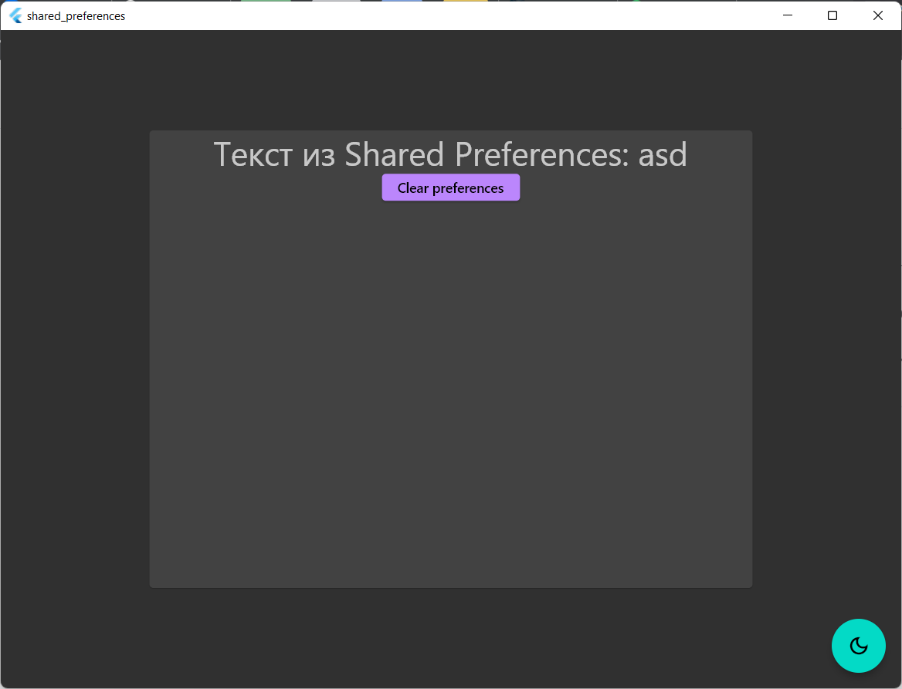

# Практическая работа №5

## Тема: Shared Preferences

### Цель работы: Реализовать восстановление данных после закрытия приложения. Если есть данные в SharedPrefrences открыть 2 экран, если данных нет то открыть 1 экран. Так же реализовать восстановление темы приложения.

__1. Подключение библиотек__

В файле `pubspec.yaml` подключим библиотеку `flutter_bloc: ^8.1.1` для работы с _Cubit_ и _Bloc_
и библиотеку `shared_preferences: ^2.0.15` для работы с _Shared Preferences_.

__2. Создание кубита для смены темы.__

Кубит для смены темы возьмем с прошлой работы, но немного изменим его. Добавим два метода для записи и получения данных
в Shared Preferences^

```dart
class ThemeCubit extends Cubit<ThemeMode> {
  ThemeCubit(this._prefs) : super(ThemeMode.light);
  final SharedPreferences _prefs;
  ThemeMode _themeMode = ThemeMode.light;

  ThemeMode get getCurrentTheme => loadThemeMode();

  void switchTheme() async {
    if (_themeMode == ThemeMode.light) {
      _themeMode = ThemeMode.dark;
      saveThemeMode();
      emit(getCurrentTheme);
    } else {
      _themeMode = ThemeMode.light;
      saveThemeMode();
      emit(getCurrentTheme);
    }
  }

  ThemeMode loadThemeMode() {
    if (_prefs.containsKey('themeState')) {
      return _prefs.getString('themeState') == 'light'
          ? ThemeMode.light
          : ThemeMode.dark;
    }
    return _themeMode;
  }

  void saveThemeMode() => _prefs.setString("themeState", _themeMode.name);

}
```

__3. Создание окна ввода.__
В данном классе добавим метод сохранения текста в _Preferences_, который будет вывзваться при нажатии на кнопку:

```dart
void onClick() async {
  final prefs = await SharedPreferences.getInstance();
  await prefs.setString('text', _textController.text);
}
```

Также при нажатии на кнопку перехода ко второму окну будем передавать туда текст через аргументы:

```dart
ElevatedButton(
  onPressed: () async {
    onClick();
    Navigator.of(context).pushNamed('/TextPage',
      arguments: _textController.text);
  },
  child: const Text('Сохранить'),
);
```

__4. Редактирование _main.dart_ файла.__

Добавим метод, который будет смотреть, есть ли в Preferences значение с ключом _text_:
```dart
Future<bool> isHaveText() async {
    final prefs = await SharedPreferences.getInstance();
    return prefs.containsKey('text');
}
```
В параметр `home` виджета `MaterialApp` добавим следующее:
```dart
FutureBuilder(
  future: isHaveText(),
  builder: (BuildContext context, AsyncSnapshot<bool> snapshot) {
    return snapshot.data == true ? TextPage() : InputPage();
  },
),
```
Это поможет показывать разные экраны в зависимости от наличия в `SharedPreferences` данных.

__5. Окно с текстом__

Добавим два метода, первый будет брать текст из SharedPreferences, второй будет очищать наши SharedPreferences.

```dart
Future<String> getText() async {
  final prefs = await SharedPreferences.getInstance();
  return prefs.getString('text') ?? 'Неполучилос';
}
void clearPreferences() async {
  final prefs = await SharedPreferences.getInstance();
  await prefs.remove('text');
  await prefs.remove('themeState');
}
```

Перед выводом текста на экран будем проверять, если данные в аргументах, 
если есть, то текст будем брать оттуда, если нет, то из SharedPreferences.
```dart
FutureBuilder(
  future: getText(),
  builder:
    (BuildContext context, AsyncSnapshot<dynamic> snapshot) {
      if (args == null) {
        text = snapshot.data;
        if (text == null) {
          return Text(
            'Ошибка',
            style: Theme.of(context).textTheme.headline4,
          );
        }
        return Text(
          'Текст из Shared Preferences: ${text!}',
          style: Theme.of(context).textTheme.headline4,
        );
      }
      text = args as String;
      return Text(
        'Текст из аргументов: ${text!}',
        style: Theme.of(context).textTheme.headline4,
      );
    },
),
```

__6. Результат работы__


### Вывод: в ходе выполнения практической работы реализовали восстановление данных после закрытия приложения.